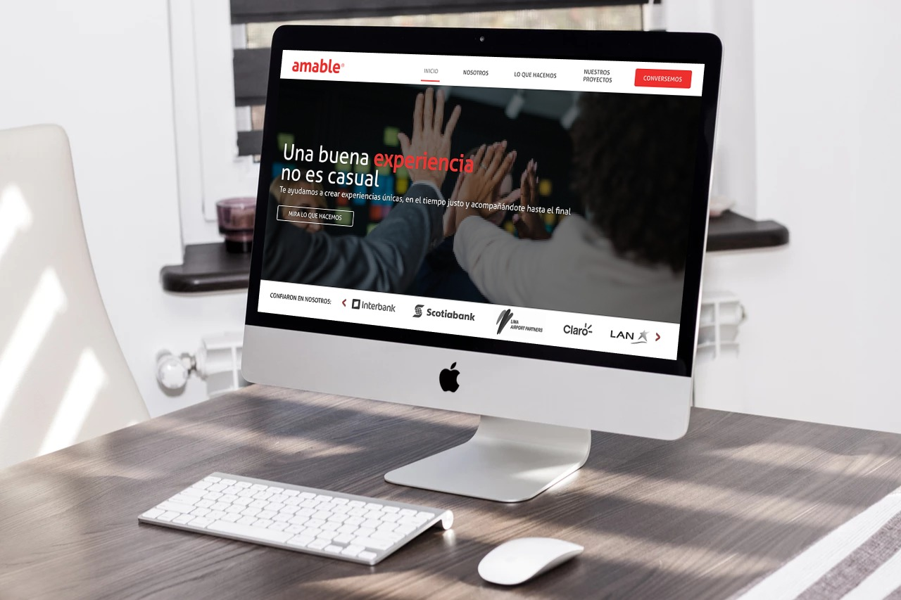
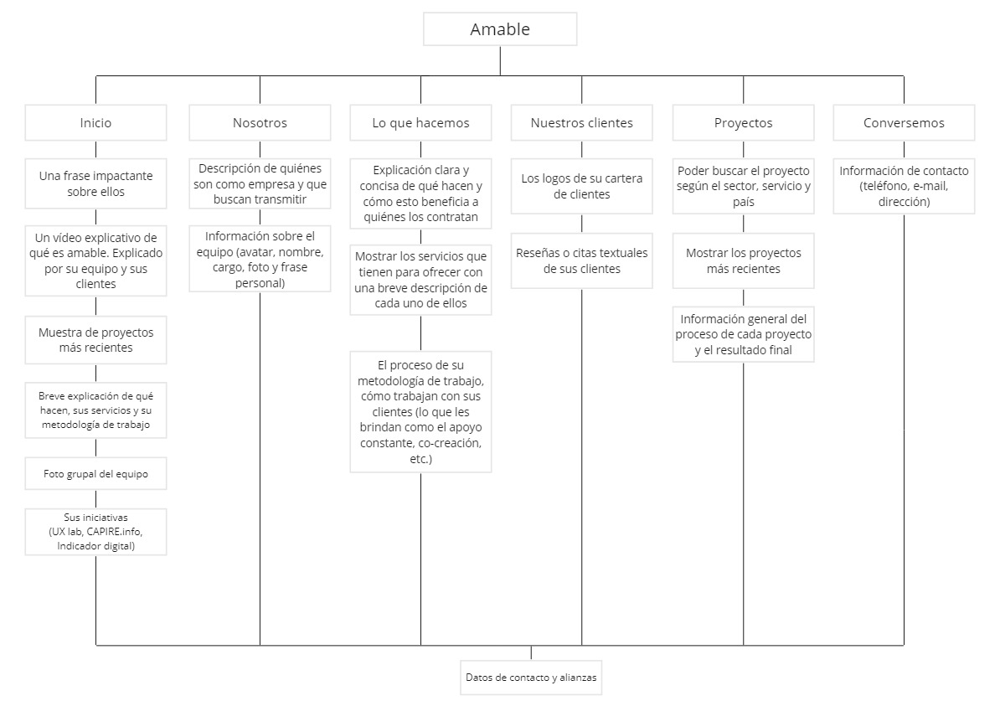
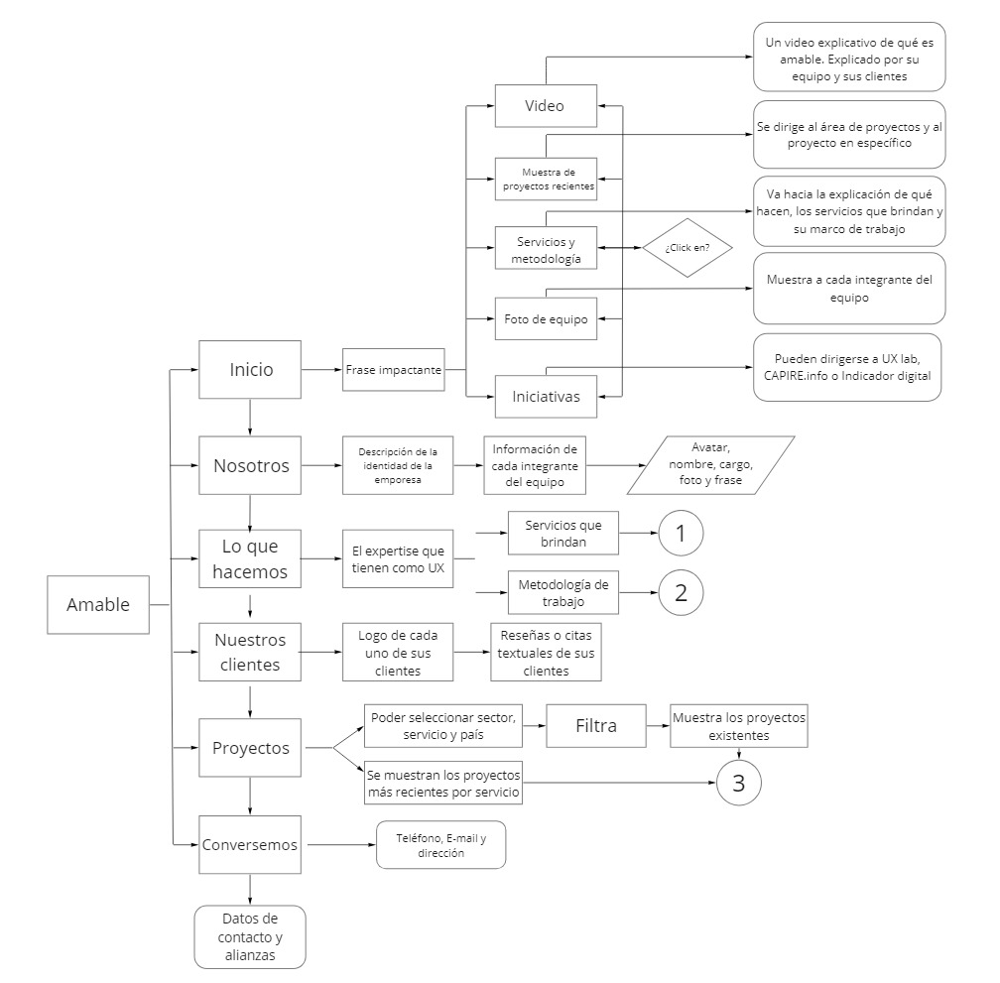

# Rediseño de la web corporativa de Amable

[(Mira aquí el prototipo clickeable)](https://www.figma.com/proto/Jr3zLTCK0QSxXIfGsl0ne1dG/Web-Amable?node-id=0%3A1&scaling=min-zoom) 

## ¿Qué es Amable?
Una consultora que brinda servicios de Diseño de Experiencia de Usuario a empresas en Argentina, Chile, Ecuador y Perú. [Conoce más sobre Amable aquí](documentos/presentacion_amable.pdf).

## El reto
Tras sufrir un hackeo en el servidor, la web de Amable tuvo que suspenderse y, en su lugar, se colocó un parche con información básica de la empresa. 

Para solucionar esta situación, rediseñaremos la página web comunicando con un lenguaje “amable” y un diseño adecuado qué es Amable y qué servicios brinda, de esta manera generará credibilidad y confianza en sus clientes.

## Proceso de rediseño
Seguimos el modelo de Design Thinking para realizar nuestro proceso de rediseño, el cual dividimos en las siguientes fases:

### Investigación

En primer lugar analizamos la [información otorgada por el cliente](documentos/research_web_amable.pdf) en donde nos brindaban algunos alcances sobre lo que su clientes consideraban útil encontrar en la página web de una consultora UX.

Para acompañar y validar los resultados, realizamos un benchmark de algunas páginas web de consultoras y agencias UX peruanas e internacionales:

Asimismo, realizamos un test de guerrilla con dos posibles clientes de una consultora UX, de manera que podamos conocer más a nuestro usuario y su perspectiva al momento de contratar una empresa de este rubro. Las preguntas fueron las siguientes:

Si estuvieses buscando una consultora que te ayude a mejorar el servicio o la experiencia que les brindas a tus clientes:

¿Cómo la buscarías, de qué formas, a través de qué medios?
¿Qué te gustaría o que esperas encontrar al estar en contacto con ella?
¿Si esta consultora tuviese una página web, que es lo principal o necesario para ti que debería tener?
¿Cuáles son los puntos más relevantes que te haría confiar o querer trabajar con la consultora?
¿A través de qué canales de contacto te gustaría comunicarte con ellos?
¿Es relevante para ti que se muestre el proceso de los proyectos que hizo la consultora? ¿Porqué?

[Aquí encontrarás los audios de las entrevistas.](https://drive.google.com/open?id=1fbG0y_sX9dFfkdf5rFoXX15XgPAB8o9T0wujBNVCN4o)

### Síntesis:

Analizamos los resultados obtenidos en la investigación y realizamos una sesión de brainstorming, en donde, a través de un ejercicio de conceptualización, otorgamos a la empresa una personalidad que nos permitía conocer mejor sus valores y lo que querían mostrar a sus clientes en la plataforma web.

Tras ello, obtuvimos los siguientes insights:

* La experiencia que tienen, el saber con quiénes han trabajado y sus casos de éxito brindan confianza y credibilidad a los potenciales clientes de Amable.
* Los potenciales clientes de Amable no tiene claro qué servicios ofrecen en su página web.
* Un lenguaje sencillo y simple ayuda a los potenciales clientes a entender mejor los servicios que brinda la empresa y genera mayor seguridad al momento de contratar los servicios.
* Los clientes de Amable los reconocen por la capacidad de co-creación que tienen con ellos: se sienten partners.
* La calidad del equipo, su profesionalismo y su background son tres de las características que más valoran los clientes de Amable.

### Ideación:

Con la información obtenida y sintetizada, comenzamos a idear la propuesta. Lo primero que hicimos fue elaborar nuestro mapa de navegación:

Seguido de nuestro diagrama de flujo:

Y finalmente utilizamos el sketching y Wireframing para hacer los prototipos de baja fidelidad de nuestra propuesta. Para realizar el wireframe usamos Balsamiq, de modo que tengamos un wireframe clickeable.

[Puedes revisar el wireframe aquí.](https://drive.google.com/open?id=1gvP7S4EdIsro0hXIiYUMjLEe8XOJ-iY3)

## Checklist
- [ ] _README_ explicando el proceso del proyecto
- [ ] Mapa de navegación
- [ ] Diagrama de flujo
- [ ] _Wireframes_
- [ ] Prototipo interactivo
- [ ] Documentación en Zeplin (o similar)
